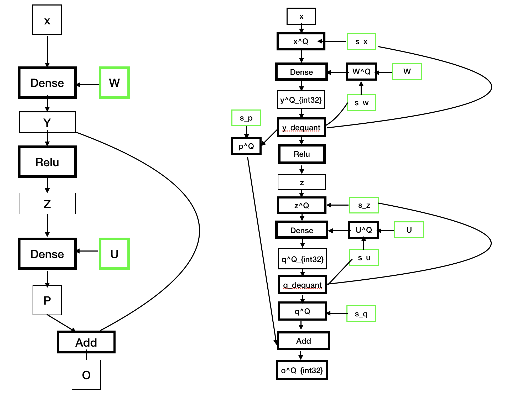

### Quantizing NN models for deployment on blockchain

Towards A Novel Deterministic Inference Infrastructure on Blockchain

## Introduction

There are emerging interests in deploying deep learning models on various platforms and devices. Especially, deep networks are seeing increasingly used for applications at the edge devices, which typically have lower compute capabilities and are constrained in memory and power consumption. Due to limited-resource and strict environment, the situation is more critical to deploy DNN models on the blockchain. In addition to limited computation resource, being deterministic is another issue, e.g., each running of a single model on the different device must produce a bit-level identical result. Nondeterministic occurs from the float-point number arithmetic, e.g., summation over a series of float-point number. 

In this post, we propose a methodology to both accelerate DNN models' inference and eliminate nondeterministic behavior in model inference for blockchain adoption. Before we go into the detail of implementation, we first go through the observation and intuition behind this methodology.

In term of edge computing, unlike GPU, float point unit is less effective and desirable on edge device. Thus, researchers have proposed several approaches to tackle this problem:

1. **Fake Quantization**: quantizing float-point number into 8-bit integer and transfer data to the accelerator, which takes linear time to apply this operation. The most costly part of the calculation, e.g., conv,  only happens in the accelerator that dedicated in 8-bit arithmetic. Afterward, results are transformed back to float-point.
2. **Integer-Only Inference**: quantization scheme that allows inference to be carried out using integer-only arithmetic, which can be implemented more efficiently than floating point inference on commonly available integer-only hardware. Fine-tune procedure is usually utilized to preserve model accuracy post-quantization

The current implementation in MXNet's Contrib library follows fake quantization routine and redirect the computation to MKLDNN math library in runtime. However, in blockchain's deterministic sensitive scenario, the float-point number is unacceptable. Therefore, we propose to adopt integer-only inference as our methodology. In addition, the numerical bound is checked to avoid integer overflow by utilizing graph level rewriting. 

## Implementation

According to the above discussion, we implemented a converter using MXNet's nnvm module, **MRT**(Model Representation Tool),  that transform a plain MXNet model into our Cortex Virtual Machine(CVM) representation.

### Fusion and Operator Rewriting

##### Fuse Constant

After all the fusion process as below, we do constant-fuse process for reducing graph complexity and better quantization performance.

##### MAC Decomposition

Supposed we are calculating the inner dot of two vector $x \in Z_{\text{int8}}^{n}$ and $y \in Z_{\text{int8}}^{n}$, which may results in a 32-bit integer, sepecifically $s=<x, y> = \sum_i^n x_i y_i \in  Z_{\text{int32}}^{n}$ . However, this condition of numerical bound is only hold when $n$ is less than $2^{16}$. In other words, we cannot assume abense of overflow when $n$ is large, which may introduce nondeterministic behavior during parallel computing. To resolve this problem, we can decomposite the computation into small peices in graph level and aggreate the results, mathmatically $s=<x^{(1)}, y^{(1)}>+<x^{(2)}, y^{(2)}> + … + <x^{(K)}, y^{(K)}>$, $x^{(k)}$ is the $k$-th part of vector $x$. Each parts of vector has length smaller than $2^{16}$.

Matrix multiplication operator `matmul` can also be rewritten in this fashion, which results in a series of `elemwise_add` operator that sum over several intermediate matrices. Although this rewriting will introduce additional operators in the computation graph, semantic will remain unchanged.

#### Fuse BatchNorm

*gamma, beta, data_mean, data_var*: attributes.
$$
\begin{align}
\text{BatchNorm(x)} &= y_{\sdot i\sdot\sdot} \\
&= {x_{\sdot i\sdot\sdot} - \mu^X_i \over \sigma^X_i} * \gamma_i + \lambda_i \\
&= x_{\sdot i\sdot\sdot} * \alpha_i + \beta_i \\
\end{align}
$$

, where $\alpha$ is $\gamma \over \sigma $ and $\beta$ is $\lambda -\mu * \gamma / \sigma$.

when $y=\text{Convolution}(x)$, we can get equation as belows:
$$
z
= (y \circledast W + b) * \alpha + \beta 
= y \circledast (W * \alpha) + (b * \alpha + \beta) \\
= \text{Convolution}(y, \text{weight}=W * \alpha, \text{bias}=b * \alpha + \beta)
$$

### Simulated quantization

Before we can make the whole computational graph integer-only, we should first rewrite float-point number into simulated quantization representation. In the current implementation, we adopt a symmetric quantization approach to quantize float-point vector $x$ to signed 8-bit type $x^Q$, specifically

​                                                                                       $$\begin{align}x=sx^{Q} \end{align}$$                             

 where $x\in \mathbf{R}^{n}, s \in \mathbf{R}, x^Q \in Z_{\text{int8}}^n$

After quantization has been applied, we can reorder the operators in the graph to further processing.  As `matmul` is the core of NN's workflows, we take it as an example to illustrate how to transform float-point operator to an integer operator. 

let's define float-point `matmul` as $y = Wx$, where $y\in \mathbf{R}^m, x\in \mathbf{R}^n, W\in \mathbf{R}^{m\times n}$. First we rewrite $x$, $y$  and $W$ into quantized representation $s_y * y^Q   = (s_wW^Q)  (s_x  X^Q) $ , and rewrite it into

​                                                                 $$ \begin{align}\\ y^Q &=(\frac{s_w s_x}  {s_y}) W^QX^Q = s_q W^QX^Q \end{align}$$

where $s_q =\frac{s_w s_x}  {s_y} $ is the requantization scalar.

In our approach, scalar $s_y $ is determined in advance by calibration. With calibrated scalar $s_y$ for output $y$ of each operator and weight scalar $ s_w$, we can further determine requantization scalar $s_q$ by definition. Thus, we can rewrite the original graph to an annotated graph as the figure showing below:

### Calibrating Requantization Parameter

Supposed that our purpose is quantizing weight and activation into $[-127, 127  ]$, which can be placed in a signed 8-bit integer. We need to determinate a range $[-h, h] $, so that we can map data into $[-127,127 ]$. Formally, we have $s_x = h/127, x^Q = \text{round}(\text{clip}(x; -h, h) / s_x)$, note that for certain large value may be cliped in order to obtain better quantization precision. 

Here, we only discuss layer-wise quantization for simplicity. For quantizing weight $w$, we can just simply set $h=\max(\{|a| | a \in x \})$ . In terms of activation, we need to feed some data to collects the intermediate result $y$. Afterward,  we can use a heuristic approach to calibrate a threshold $h$ to get $y^Q$ best approximate $y$. For example, in MXNet's quantization package, we can utilize the entropy-based calibration method to find the best fit. 

We adopt a simple method in our implementation, which use shift bit instead of a floating scale for requantization that will reduce work in symbol realizing. For a positive float-point scale $s$,  we can rewrite it as $s\sim s_02^{-b}$, where $s_0$ and $b$ are positive integer. 

###Realize Integer-only Inference

After rewriting graph according the methods mentioned above, the float operation only occurs on `broadcast` operator, e.g. `broadcast_multiply`.  Let's take it as a example, this operator is mainly introduced by requantizaiton procedure. We can also rerwrite is as $y=s_02^{-b}y^Q_{\text{int32}}=((s_0>>p)(y^Q>>q))>>(r+b)$, where $p, q$ and $r$ can be calibrated for best performance. The first two `shift` operators is used to avoid overflow during computation, last `shift` is used for requantization. Noted that $y$ and $y^Q$ both are tensors.

## Experiment

After we convert original float-point model to our CVM reprenstation, approximately 4x model size reduction can be achieved, while accuracy not will be harmed significantly. Beside, we only introduce a little additonal computation overhead, e.g. requantization. Thus, the amount of opeators (OPs) is keeped in same order of magnitudes. And all operators in model can be optimized using vectorization techniques, which will reduce the time of compuatation intensively, e.g. avx512-vnni instruction set.

We apply proposed converter on pretrained models(imagenet) data from MXNet's model zoo. Result is showing as below. 

| Imagenet MODEL         | MXNet  |  CVM   |
| ---------------------- | :----: | :----: |
| ResNetV1_50            | 77.37% | 76.16% |
| ResNet18_v1b_0.89      | 67.21% | 63.65% |
| InceptionV3            | 78.78% | 78.31% |
| AlexNet                | 55.92% | 55.19% |
| SqueeseNet             | 57.20% | 55.62% |

| Mnist MODEL     | MXNet  |  CVM   |
| --------------- | :----: | :----: |
| DigitalClashNet | 99.18% | 99.18% |

We can observe that our quantization scheme retain the accuracy of ResNetV1 and InceptionV3 on imagenet dataset. 

For the model already deployed in Cortex Testnet, DigitalClashNet, which is used in most popluar DAdpp in Cortex Testnet, accuracy is almost keeped.

## Conclusion

Using MXNet’s quantization technology, model inference can be enabled on the limited-resource and strict environment of blockchain, unlocking a novel domain of smart contracts with machine learning models. The use case could be DeFi, Entertainment, Information service, BaaS, etc.

## Future work

Enhancing privacy, accuracy, and efficiency. Mobile/edge computing realization is also one of our goals.

