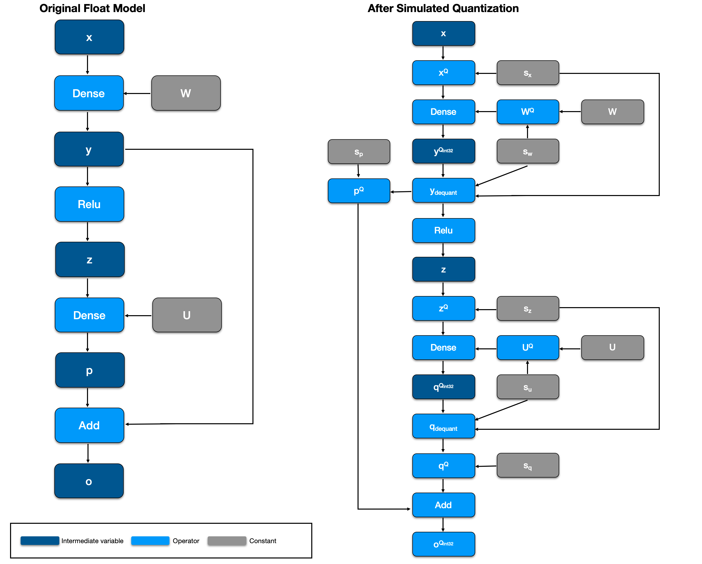
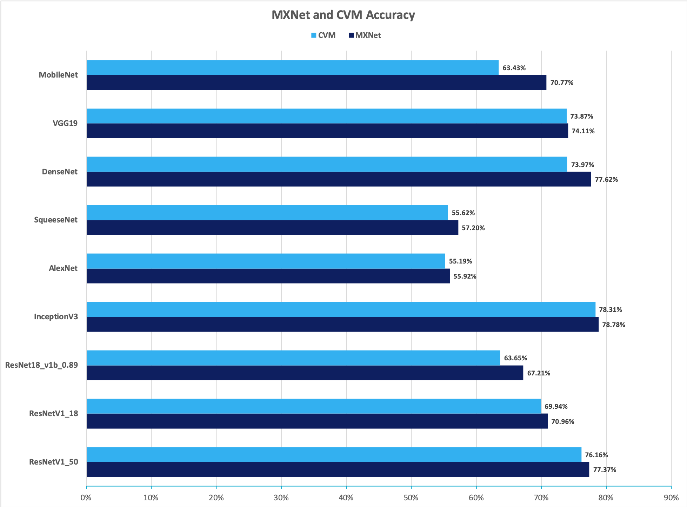

### Quantizing Ｎeural Ｎetwork Ｍodels in MXNet for Strict Consistency on Blockchain

Towards A Novel Deterministic Inference Infrastructure on Blockchain

## Introduction

There is significant interest in deploying deep learning models on various platforms and devices. Deep neural networks are not just being used in supercomputers or GPU clouds, but are also experiencing increased adoption in resource-constrained devices, or edge devices. Unlike supercomputers, edge devices have low computing power with memory and energy consumption constraints. In the emerging field of blockchain, where it demands every step of computation to be strictly deterministic and have minimal resource consumption, it is even harder for a neural network to deploy.

As the technology of distributed ledger develops, needs for more complex computations emerge. The nondeterministic nature of floating-point arithmetic and parallel computation, e.g., summation over a series of floating-point numbers, should not be a problem for DNN models in a cloud computing environment, since the purpose of DNN model inference is often for better precision, not for future auditing or bit-level comparison. However, the nondeterministic result is undesirable in the occasion of blockchain, where different nodes need to verify the transactions to reach consensus before finalizing on the blockchain. Each node has its own hardware specification running different versions of operating systems, making it harder to standardize the computation. In other words, every single run of a model, with the same input, in heterogeneous computing systems must yield bit-level identical results. For more background information about blockchain and determinism, please move to the end of this article.

In this post, we propose a framework to accelerate DNN models’ inference and eliminate nondeterministic behavior in model inference for blockchain systems. Before we dive into implementation details, let’s go through a few key observations and intuitions that lead to the discovery of our framework first.
Researchers have proposed several approaches to run DNN models in limited-resource environments:

1. **Simulated Quantization**: also known as [Fake quantization](http://openaccess.thecvf.com/content_cvpr_2018/papers/Jacob_Quantization_and_Training_CVPR_2018_paper.pdf)[1], quantizing floating-point numbers into 8-bit integers and transferring data to the accelerator, which takes linear time. The most costly part of the calculation, e.g., conv, only happens in the accelerator which is dedicated in the 8-bit arithmetic. Afterward, results are transformed back to floating-point numbers.
2. **Integer-Only Inference**: quantization scheme that allows inference to be carried out using integer-only arithmetic, which can be implemented more efficiently than floating-point inference on commonly available reprogrammable hardware, e.g [FPGA](https://www.xilinx.com/support/documentation-navigation/silicon-devices/fpga.html). Fine-tune procedure is usually utilized to preserve model accuracy.

We apply integer-only inference in our approach. The current implementation in [MXNet’s Contrib ](https://mxnet.incubator.apache.org/api/python/ndarray/contrib.html#mxnet.ndarray.contrib.quantize)library follows the simulated quantization routine and redirects the computation to MKLDNN math library in runtime. However, in blockchain’s deterministic scenario, floating-point numbers will introduce undesired behaviors. Integer-only inference, on the other hand, fits blockchain’s heterogeneous environments perfectly. Moreover, we put a strict numerical bound to avoid integer overflow by rewriting computation graph.We apply integer-only inference in our approach. The current implementation in MXNet's Contrib library follows the fake quantization routine and redirects the computation to MKLDNN math library in runtime. However, in blockchain's deterministic scenario, floating-point numbers will introduce undesired behaviors. Integer-only inference, on the other hand, fits blockchain's heterogeneous environments perfectly. Moreover, we put a strict numerical bound to avoid integer overflow by rewriting computation graph.

## Implementation

Cortex is an Ethereum-based blockchain platform where we practice our approach. The framework includes two major components: MRT for quantization and CVM for inference. First, We implement a converter using MXNet’s [NNVM](https://tvm.ai/2017/10/06/nnvm-compiler-announcement.html) module, named **Model Representation Tool** (MRT), to convert the [MXNet Model Zoo](https://mxnet.incubator.apache.org/api/python/gluon/model_zoo.html) to quantized models. Second, we run the quantized models in the Cortex blockchain’s virtual machine **Cortex Virtual Machine** (CVM), the runtime environment for smart contracts equipped with machine learning models.Cortex is a ethereum-based blockchain platform where we practice our approach. The framework includes two major components: MRT for quantization and CVM for inference. First, We implement a converter using MXNet's NNVM module **Model Representation Tool** (MRT) to convert MXNet Model Zoo to quantized models. Second, we run the quantized models in the Cortex blockchain's virtual machine **Cortex Virtual Machine** (CVM), the runtime environment for smart contracts equipped with machine learning models.

#### Fusion and Operator Rewriting

We illustrate our approach by following examples.  

##### MAC Decomposition

To rewrite the MAC (Multiply and ACcumulate) operator, suppose we are calculating the inner dot of two 8-bits integer vectors x and y, which may results in a 32-bit integer, specifically,

$$
s=<x, y> = \sum_i^n x_i y_i \in  Z_{\text{int32}}^{n}
$$

However, this condition of numerical bound holds only when *n* is less than 2¹⁶. In other words, we cannot assume that there is no overflow when *n* is large, which may introduce nondeterministic behavior during parallel computing. To resolve this problem, we decompose the computation into smaller sub-problems in graph level and aggregate the results. Mathematically, $s=<x^{(1)}, y^{(1)}>+<x^{(2)}, y^{(2)}> + … + <x^{(K)}, y^{(K)}>$, $x^{(k)}$ is the $k$-th part of vector $x$ with each partition's length smaller than $2^{16}$. Figure. 1 is a visualization of the decomposition.

*Figure. 1*

Matrix multiplication operator `matmul` can also be rewritten in the same fashion, generating a series of `elemwise_add` operators that sum over several intermediate matrices. The semantics is unchanged although this step introduces additional operators in the computation graph.

##### Fusing BatchNorm

$$
\begin{align}
y_{\sdot i\sdot\sdot}&= \text{BatchNorm}(x_{\sdot i\sdot\sdot})  \\
&= {x_{\sdot i\sdot\sdot} - \mu^X_i \over \sigma^X_i} * \gamma_i + \lambda_i \\
&= x_{\sdot i\sdot\sdot} * \alpha_i + \beta_i \\
\end{align}
$$
where $\alpha_i$ is $\gamma_i \over \sigma^X_i $ and $\beta_i$ is $\lambda_i -\mu_i * \gamma_i / \sigma_i^X$.

We can see that BatchNorm can be fused into Convolution's weight. As a result, we have:
$$
\begin{align}
\\
z &=\text{BatchNorm}(\text{Convolution}(x)) \\
& = (x \circledast W + b) * \alpha + \beta = x \circledast (W * \alpha) + (b * \alpha + \beta) \\
&= \text{Convolution}(x, \text{weight}=W * \alpha, \text{bias}=b * \alpha + \beta)
\end{align}
$$

##### Rewrite GlobalAvgPooling

For some operators, which can be implemented in lower-level operator, we can rewrite it to a combination of these sets of low-level operators. Usually, this kind of rewriting can facilitate the quantization pass. Let’s take **GlobalAvgPooling** as an example,
$$
\text{GlobalAvgPooling}(x) =\frac{1} { K * K } \sum_{k_i} \sum_{k_j} x_{\sdot\sdot k_ik_j} \\
= \text{broadcast_mul(sum(data, axis=(2, 3)), scale)}
$$
where scale equals $1 / (K * K)$.

##### Fusing Constant

After the fusion processes described above, we run a constant-fusing procedure to reduce graph complexity for better quantization performance. For example, suppose we want to compute a dot product of two vectors followed by a series of scalar operators, e.g., y=<x,w>*a/b. Here, a and b both are scalars. We can fuse them into w, which results in a single dot product operator y=<x, w’>, where w’=w*a/b.

### Simulated quantization

Before we can make the whole computation graph integer-only, we should first rewrite floating-point numbers into simulated quantized representation. In the current implementation, we adopt a symmetric quantization approach to quantize floating-point vector *x* to signed 8-bit type x^Q, specifically,

$$\begin{align}x=sx^{Q} \end{align}$$                             where $x\in \mathbf{R}^{n}, s \in \mathbf{R}, x^Q \in Z_{\text{int8}}^n$

After applying quantization, we reorder the operators in the graph for further processing.

As `matmul` is the core of neural network workflows, we use it as an example to illustrate how to transform a floating-point operator to an integer operator.

Let’s define floating-point `matmul` as,

$y = Wx$, where $y\in \mathbf{R}^m, x\in \mathbf{R}^n, W\in \mathbf{R}^{m\times n}$

First we rewrite $x$, $y$  and $W$ into quantized representation $s_y * y^Q   = (s_wW^Q)  (s_x  X^Q) $ , and rewrite it into

$$ \begin{align}\\ y^Q &=(\frac{s_w s_x}  {s_y}) W^QX^Q = s_q W^QX^Q \end{align}$$

where $s_q =\frac{s_w s_x}  {s_y} $ is the requantization scalar.

In our approach, scalar $s_y$ is determined in advance by calibration. With calibrated scalar $s_y$, for output $y$ of each operator and weights scalar $s_w$, we can further determine requantization scalar $s_q$ by definition. 

Thus, we can rewrite the original graph into an annotated graph as shown in Figure. 2:

*Figure. 2*

### Calibrating Requantization Parameter

Assume our purpose is to quantize weight and activation into $[-127, 127]$ that can be placed into a signed 8-bit integer. We need to determine a bounding range $[-h, h]$, so that we can map data into $[-127,127]$. Formally, we have

 $s_x = h/127, x^Q = \text{round}(\text{clip}(x; -h, h) / s_x)$

, note that large values may need to be clipped for better quantization precision. 

To simplify things, we do only layer-wise quantization, which uses only one scalar *h* for each layer. For quantizing weight *w*, in practical, we can set $h=\max(\{|a| | a \in x \})$

In terms of activation *y*, e.g., the output of *Conv* layer right before feeding to *relu*, we need to feed some real-world data to collect the intermediate result of a reasonable range of *y*. Then we can use a heuristic approach to calibrate a threshold *h* to get *y* that best approximates *y*. If using MXNet’s quantization package, we can utilize the entropy-based calibration method to find the best fit.

We take an approach of using shift bit instead of a floating point for requantization that reduces work in symbol [realization pass](https://arxiv.org/pdf/1904.08368.pdf). For a positive floating-point scale *s*, we rewrite it as

$s\sim s_02^{-b}$, where $s_0$ and $b$ are positive integer. 

### Realizing Integer-only Inference

After rewriting the graph, the float operation only occurs on `broadcast` operator, e.g., `broadcast_multiply.` Taking it as an example, this operator is mainly introduced by the requantization procedure. We rewrite it as, $y=s_02^{-b}y^Q_{\text{int32}}=((s_0>>p)(y^Q>>q))>>(r+b)$, where *p*, *q,* and *r* can be calibrated for the best performance. The first two `shift` operators are used to avoid overflow during computation, and the last `shift` is used for requantization. Note that both *y* and *y^Q* are tensors.

## Experiment

Converting the original floating-point model to our CVM representation results in approximately 4x model size reduction while the model accuracy does not decrease significantly. Besides, we only introduce minor additional computation overheads, e.g. requantization, keeping the number of operations in the same order of magnitude. All operators in the model can be further optimized using vectorization techniques, which will reduce the computation time dramatically, e.g., avx512-vnni instruction set.

We apply the proposed converter on pre-trained models with ImageNet dataset from MXNet Model Zoo. The results of top-1 accuracy are shown in Figure. 3,

*Figure. 3*

We can see that the top-1 accuracies for ResNetV1 and InceptionV3 on ImageNet dataset are retained after our quantization scheme.

We also apply the proposed converter on pre-trained models with MNIST dataset. The result is shown in Table. 1:

| MNIST MODEL     | MXNet  |  CVM   |
| --------------- | :----: | :----: |
| DigitalClashNet | 99.18% | 99.18% |
| LeNet           | 99.18% | 99.16% |
| MLP             | 97.68% | 97.69% |

We can also see that our quantization scheme does not lose accuracy. [DigitalClashNet](https://medium.com/cortexlabs/the-first-cortex-ai-dapp-the-master-of-digital-clash-5267e2a71492), which has been deployed in Cortex TestNet and used in a DApp, retains the accuracy.

### Background

Here’s a bit more of background information for readers who are new to blockchain.

1. Why is deep learning useful for blockchain applications?

Blockchain is a trending topic in both tech and non-tech fields. As people find more and more use cases of blockchain, both financial-level and consumer-level data have been accumulating on various blockchains. However, the computing power on a reliable decentralized public chain is far from enough to perform sophisticated analysis for areas of most interest. Potential applications for DL models on the blockchain includes:

- DeFi: credit score, anti-fraud in decentralized exchanges, p2p financing

- Gaming: auto judging, player agent, NPC, assistant/coaching/education

- Governance. utilizing DL in stablecoins, sentiment analysis, decentralized decision making

- Traditional DL-only Apps: on-chain data mining, facial recognition, recommendation, chatbot, machine translation, voice synthesis, etc.

2. Why is determinism important?

As described in the original [satoshi’s whitepaper](https://bitcoin.org/bitcoin.pdf), blockchain is a decentralized system that relies on periodical blocks as checkpoints to determine a global order of transactions. In alternative blockchain designs like DAG or federated chains, participants still need to agree on partial order of correlated transactions. Determinism is key to blockchain because the sole purpose of blockchain is to maintain a global ledger that everyone agrees to append on. For blockchain schemes that support on-chain computation, each step of the program must be deterministic to reach consensus, which means all results must be the same when the program is executed on heterogeneous architectures. This determinism poses new challenges to DL models which we find intriguing to solve.

## Conclusion

Based on MXNet, we have built a deterministic quantization framework, where model inference can be enabled on the limited-resource and strictly deterministic environment of blockchain, enabling a new domain of smart contracts with machine learning models. This framework can be found useful in a variety of applications: Decentralized Finance, Entertainment, Information service, Blockchain as a Service, etc.

## Future work

Quantization is a relatively new field that has more to study, like federated training, asymmetric quantization, channel/group-wise quantization, privacy, etc. We will continue to explore possible applications and implementations of quantization in MXNet.

[1] Jacob, Benoit, et al. “Quantization and training of neural networks for efficient integer-arithmetic-only inference.” *Proceedings of the IEEE Conference on Computer Vision and Pattern Recognition*. 2018.Quantization is a relatively new field that has more to study, like federated training, assymetric quantization, channel/group-wise quantization, privacy, etc. We will continue to explore possible applications and implementations of quantization in MXNet.