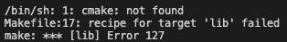

# Write & Upload AI Models to Cortex

# Introduction

Cortex is currently the _only_ public blockchain that allows on-chain execution of machine learning models. Every step of the inference is transparent to the public, verified by blockchain consensus.

**Why should I upload my model to Cortex?**

You will get paid a small amount in CTXC each time your model is called in a smart contract. This award comes from part of miner's award and its aim is to incentivize ML developers to upload their models to the blockchain for the world to use.

A few vocabulary essential for the rest of the tutorial:

**CVM**:

CVM, short for Cortex Virtual Machine, is the core of the Cortex blockchain. It is responsible for executing code on-chain. It is backward compatible with Ethereum's [EVM](https://ethdocs.org/en/latest/introduction/what-is-ethereum.html) with added support for on-chain machine learning inference. While it is virtually impossible to execute nontrivial ML models on the EVM, CVM is specially designed for on-chain ML inference with innovations such as utilization of node machines' GPUs and deterministic quantization of ML models.

**CVM-Runtime**:

An open-source deterministic machine learning framework written in C++. During runtime, the CVM (Cortex Virtual Machine) executes your models via CVM-Runtime. It is comparable to other frameworks such as MXNet, TensorFlow etc. with the important distinction that it is deterministic.

**MRT**:

MRT (written in Python) is one of the most important parts of CVM-Runtime. It quantizes and prepares your model for on-chain execution by CVM-Runtime. At the risk of oversimplification, MRT compresses and converts your model from floating point to integer only so that its execution is efficient and deterministic across different devices. The original research was endorsed by the official team of Amazon MXNet and the details can be read [here](https://medium.com/apache-mxnet/quantizing-neural-network-models-in-mxnet-for-strict-consistency-on-blockchain-b5c950674866).

In this tutorial, we will write a simple handwritten digit recognition model, convert it via MRT, and upload it to the Cortex blockchain so that it can be executed on-chain.

We will work through be 4 main stages

(1) Install CVM-Runtime (including MRT) and other dependencies.

(2) Train a model using the MXNet framework.

(3) Quantize the model trained in stage (2) using MRT.

(4) Upload the model

**Prerequisites:**

- A machine with the Linux Operating System <sup>[1]</sup>. The official implementation is currently only in Linux, but if you're passionate about implementing CVM-Runtime in a different operating system, pull requests are more than welcomed!

- A machine with GPU and CUDA installed properly for your Linux version.

- Working knowledge of Linux/Unix programming.

- Willingness to debug for yourself. While we seek to be as comprehensive as possible in this tutorial, we cannot cover all the idiosyncrasies of different machines and environments.

If you encounter any problems during the course, feel free to reach out to our core dev team via our [Telegram](https://t.me/CortexOfficialEN) or [Twitter](https://twitter.com/CTXCBlockchain/). We seek to constantly improve our documentation.

Let's get started!

# Tutorial

## Stage I: Install CVM-runtime and Other Dependencies

### **Install CVM-Runtime**

### 1. Git clone the CVM-runtime repository

```bash
git clone -b wlt https://github.com/CortexFoundation/cvm-runtime.git

cd cvm-runtime
```

### 2. Configure for compilation

In `config.cmake`, set the `ENABLE_CUDA` variable to `ON` on line 6. This allows us to utilize the GPU.


### 3. Compile

You may need to install `make` if you have not already.

```bash
make -j8 lib
```

If you encounter this error below



you should install `cmake`. Try the following commands:

```bash
sudo apt-get update
sudo apt-get install cmake
```

Now type `g++` in your shell to see if you have `g++` installed. If not, run `sudo apt-get install g++`

You might need to switch to a machine with GPU and CUDA installed if you don't have one.

### **Install MXNET & MRT dependencies**

Now go to [MXNET's website](https://mxnet.apache.org/get_started/?platform=linux&language=python&processor=gpu&environ=pip&) to
install the GPU version of MXNET suited for your CUDA. The install command should look something like

```bash
pip3 install mxnet-cu102
```

Run `$nvcc --version` to find out your CUDA version; make sure that it matches the number after "cu", in this case it is general version 10.

Now run the commands below to install other dependencies needed for our model training and quantization later.

```
pip3 install gluoncv

make dep
```

# Stage II: Train Your Model

Execute the following command:

```bash
python3 tests/mrt/train_mnist.py
```

This Python program does two things (1) train a handwritten digit model using MXNet. (2) prepare your dataset (MNIST in this case) for the MRT, which needs to see your dataset in order to get an idea of the range of activation values - only then can it know how to quantize your model for optimal performance.

It will take a few minutes to run. Upon completion, the trained model is stored under `~/mrt_model` (assuming you're `cvm-runtime` folder is under the root directory. If not, your model should be under `../mrt_models`).

**Very Important Note:**
If you're training a custom model with your custom dataset, keep in mind that you must alter the source code to allow MRT to read your dataset properly. We're working on a more friendly interface regarding this. Meanwhile, feel free to directly alter the source code yourself for workarounds.

# Stage III: Quantize Your Model

To prepare the model for the Cortex blockchain, we need to quantize it with MRT. Recall from Introduction that MRT is a tool originating from Cortex's research in on-chain inference of ML models - it helps us quantize ML models for deterministic inference on the blockchain.

Execute the following command:

```bash
python3 python/mrt/main2.py python/mrt/model_zoo/mnist.ini
```

All the pre-quantized model configuration file is stored in `python/mrt/model_zoo`, and the file `config.example.ini` expositions all the key meanings and value.

# Stage IV: Upload Your Model

Now the model is fully quantized, we're ready to upload it! Let's go the [Cerebro Explorer](https://cerebro.cortexlabs.ai/) .

In the menu bar at the top, find "upload" under "AI Contract"


`mnist_.json` and `mnist_.params` are your models, stored under `~/mrt_model` (assuming you're `cvm-runtime` folder is under the root directory. If not, your models should be under `../mrt_models`).

# Conclusion

Voila! You have successfully trained a handwritten digit recognition model and uploaded it to the Cortex blockchain. Now anyone, anywhere in the world can see and use your model. Each time your model is called, you will get a small reward in CTXC (this amount comes from a share of the miner's award). Note that this amount will be added to the balance of the address from which you deployed the model, but reward of one single call to your model is small so you need to adjust the unit to Turing to be able to see it.

If you want to learn how to call your model from a smart contract, we have a [tutorial](https://github.com/CortexFoundation/tech-doc/blob/master/hello-world-tutorial-contract.md) for that too.

Happy building!
<br />
<br/>
<br/>

# FAQ

1. Relationship between CVM-Runtime, CVM and MRT?

CVM is the virtual machine that executes code on the Cortex blockchain. CVM-Runtime, if you recall from earlier, is a machine learning framework responsible for on-chain execution of _ML models_. You can consider CVM-Runtime part of the CVM; in fact, it is perhaps the biggest innovation of CVM - before CVM, there was no known way to execute ML models on-chain. MRT is the part of CVM-Runtime that prepares regular float-point ML models (via quantization) for execution on-chain. You can learn more details from this tree graph [here](https://github.com/CortexFoundation/tech-doc/blob/master/cortex-guide.md).

# Footnotes

[1] If you don't have access to a Linux system locally, you can open a Linux EC2 Instance on AWS and connect it to your editor via ssh. There will be a more detailed bonus tutorial on how to set this up - for now, here are the general steps to setting up a Linux system on AWS. Play around with it and use google if you get stuck. You're always welcomed to ask questions in our Telegram group.

> (1) Go to AWS console, set up an EC20 Ubuntu (Ubuntu is one of the most user-friendly Linux systems) Instance.

> (2) Start a folder named `.ssh`, put in your key pair and start a text file named `config`

> (3) Open the command palette in Visual Studio code (`command + P` in Mac), type in
> `> Remote-SSH: Connect to Host`
> Then choose `Add New SSH Host`.

> Type in your address `ubuntu@your-aws-instance-public-ip`

> Substitute in your own public ip here. Note that each time you restart your instance, the public ip changes, so you need to reconfigure upon each restart.

> Type in the absolute path to your configuration file. Your path should end with something like `/.ssh/config`
