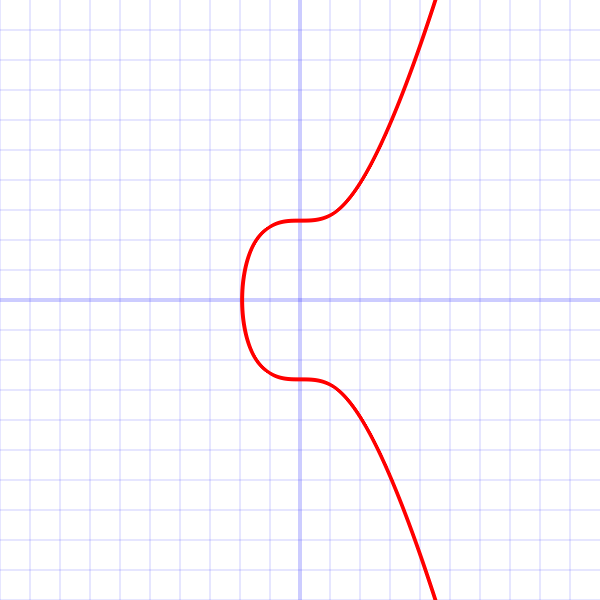
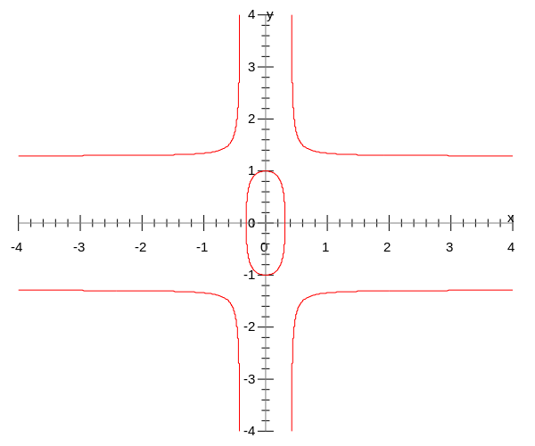

# zkRollup

这个文档主要介绍zkRollup用到的密码学组件：secp256k1，baby_jubjub和alt_baby_jubjubu加密方法

## Secp256k1

非对称加密的方案都是基于有限域上对数难问题来构造的。传统的RSA加密方案采用整数有限域，而椭圆曲线加密方案采用的二维点的有限域，有限域上的所有点都满足一类特殊形式的椭圆曲线：$y^2=x^3+ax+b \mod p$。椭圆曲线方案在同样密码安全性下比RSA方案更高效。

Secp256k1特指一条椭圆曲线：$y^2 = x^3 + 7$，这条椭圆曲线最早被比特币采用。

椭圆曲线里面的基本元素不是数而是点（$x,y$），因此加法和乘法也需要重新定义。形象来说，两个点的加法，就是两个点的连线，与椭圆曲线的交点关于x轴的对称点。如下图所示，因为整个曲线关于x轴对称，所以结果也在椭圆曲线上。每个点加自己就是关于该点的切线与椭圆曲线的交点关于x轴的对称点。

从一个点出发，不断加自己，可以遍历整个有限域，这个域就是循环域。出发点就是生成元 $G$。

椭圆曲线的密码参数 $T = (p,a,b,G,n,h)$

- $p$ 是椭圆曲线数的有限域的大小，这里是一个大素数 $p =  2^{256} - 2^{32} - 2^9 - 2^8 - 2^7 - 2^6 - 2^4 - 1$

- $a,b$ 是椭圆曲线的参数，这里 $a = 0, b = 7$

- 生成元 $G$ 的压缩形式是 $G = 02\ 79BE667E\ F9DCBBAC\ 55A06295\ CE870B07\ 029BFCDB\ 2DCE28D9\ 59F2815B\ 16F81798$，

  完整形式是$G = 04\ 79BE667E\ F9DCBBAC\ 55A06295\ CE870B07\ 029BFCDB\ 2DCE28D9\ 59F2815B\ 16F81798\ 483ADA77\ 26A3C465\ 5DA4FBFC\ 0E1108A8\ FD17B448\ A6855419\ 9C47D08F\ FB10D4B8$

  区别应该就是压缩形式记录 $y$ 然后代入函数计算 $x$，完整形式直接存 $x$ 和 $y$。

- $n = FFFFFFFF FFFFFFFF FFFFFFFF FFFFFFFE BAAEDCE6 AF48A03B BFD25E8C D0364141$

- $h = 01$

## baby_jubjub

Baby jubjub 是另一条椭圆曲线，[EIP-2494](https://eips.ethereum.org/EIPS/eip-2494) 提出的。

zk-SNARK 通过对链下计算提供零知识证明能提升以太坊性能，并且保障隐私性。zk-SNARK协议（ [[Pinnochio\]](https://eprint.iacr.org/2013/279.pdf) 和 [[Groth16\]](https://eprint.iacr.org/2016/260.pdf)）在证明和验证的时候都需要椭圆曲线运算，需要曲线满足有限域 $F_r$，以太坊采用alt_bn128(BN254)曲线，不支持zk-SNARK的ECC计算。而 Baby jubjub 的特点在于，专门为zk-SNARK计算设计的。

Baby jubjub 属于一类特殊的椭圆曲线，扭曲爱德华滋曲线：$ax^2 + y^2 = 1 + dx^2y^2$，如下图所示，这个曲线关于 x 轴和 y 轴都对称。

参数如下：

- $r = 21888242871839275222246405745257275088548364400416034343698204186575808495617$
- $a = 168700$
- $d = 168696$
- $n = 21888242871839275222246405745257275088614511777268538073601725287587578984328$
- $n = h \times l$，$l$ 是素数
- $h = 8$
- $l = 2736030358979909402780800718157159386076813972158567259200215660948447373041$
- $G = (x,y)$
- $x = 995203441582195749578291179787384436505546430278305826713579947235728471134$
- $y = 5472060717959818805561601436314318772137091100104008585924551046643952123905$
- $B = (x,y) = l \times G$
- $x = 5299619240641551281634865583518297030282874472190772894086521144482721001553$
- $y = 16950150798460657717958625567821834550301663161624707787222815936182638968203$

计算：

- $P1 = (x1, y1)$，$P2 = (x2, y2)$，$P1 + P2 = (x3, y3)$

- $x3 = (x1*y2 + y1*x2)/(1 + d*x1*x2*y1*y2)$
- $y3 = (y1*y2 - a*x1*x2)/(1 - d*x1*x2*y1*y2)$

实现：

- Python: https://github.com/barryWhiteHat/baby_jubjub_ecc
- JavaScript: https://github.com/iden3/circomlib/blob/master/src/babyjub.js
- Circuit (circom): https://github.com/iden3/circomlib/blob/master/circuits/babyjub.circom
- Rust: https://github.com/arnaucube/babyjubjub-rs
- Solidity: https://github.com/yondonfu/sol-baby-jubjub
- Go: https://github.com/iden3/go-iden3-crypto/tree/master/babyjub

## alt_baby_jubjub

